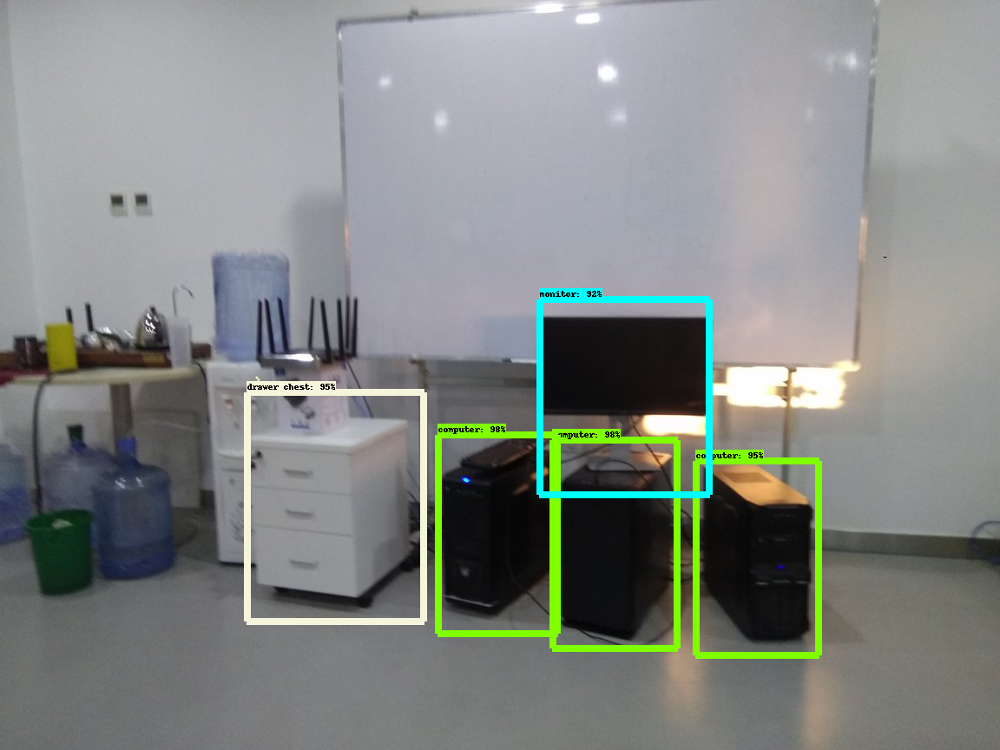

作业说明：
       1、修改object_detection/dataset_tools/my_createdata.py 用来生成测试数据

       2、修改dataset/ssd_mobilenet_v1_pets.config

       3、配置run.sh 配置相关目录

       4、dataset目录下主要放置与训练数据，以及配置文件

       5、out目录为输出目录，输出的结果存放在里头

       6、log.txt 为日志输出

输出结果为：
	

